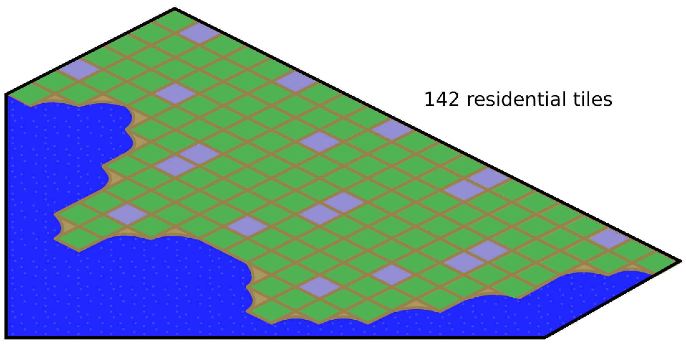

# SimCityOpt

Simple branch-and-bound implementation that seeks to maximize the number of residential tiles in a simplified SimCity map given a rule that each residential tile (green) can be at most a hamming distance of 2 from a commercial tile (blue). 

